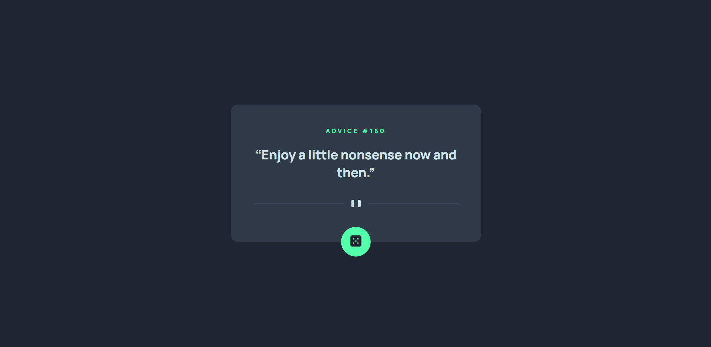
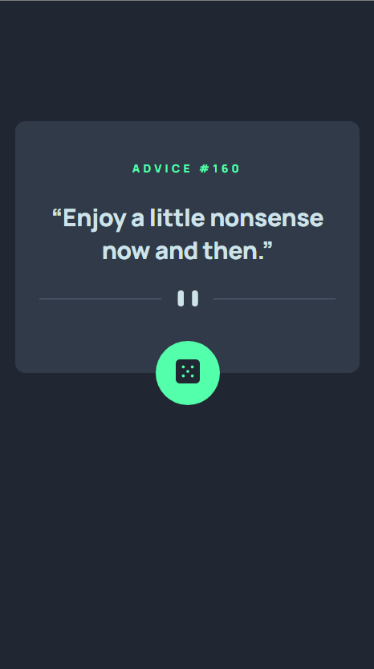

# Advice generator app solution

## Table of contents

- [Overview](#overview)
  - [The challenge](#the-challenge)
  - [Screenshot](#screenshot)
  - [Links](#links)
- [My process](#my-process)
  - [Built with](#built-with)

## Overview

This is the first time that I have used React for a Frontend Mentor project. I know it is a bit of an overkill, but I just want to practice my React skills. Any feedback would be appreciated (especially on the React side of things.)

### The challenge

Users should be able to:

- View the optimal layout for the app depending on their device's screen size
- See hover states for all interactive elements on the page
- Generate a new piece of advice by clicking the dice icon

### Screenshot

### Links

- Solution URL: [https://github.com/arfarobs/advice-generator-app](https://github.com/arfarobs/advice-generator-app)
- Live Site URL: [https://boisterous-praline-975f5b.netlify.app/)
- Frontend Mentor URL: [https://www.frontendmentor.io/solutions/advice-generator-react-html-css-api-mobile-first-js-BJzDMR9Gc](https://www.frontendmentor.io/solutions/advice-generator-react-html-css-api-mobile-first-js-BJzDMR9Gc)

## My process

- Write JSX.
- Style mobile view
- Style desktop view
- Style active states
- Add the API
- Write readme

### Built with

- Semantic HTML5 markup
- CSS
- Flexbox
- Mobile-first workflow
- Advise slip API
- [React](https://reactjs.org/) - JS library
